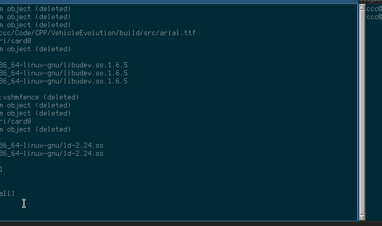

# VehicleEvolution
Projekt wykorzystuje algorytm genetyczny do tworzenia coraz lepszych pojazdów do jazdy po losowo generowaniej trasie 2D.

### Prezentacja

### Zależności & instalacja

Projekt VehicleEvolution korzysta z dwóch bibliotek zewnętrznych: [Box2D](https://github.com/erincatto/Box2D) oraz [SFML](https://github.com/SFML/SFML). W folderze lib/ dostępne są skrypty pobierające ich kod z repozytorium git oraz kompilujące je.

Sama bilbioteka SFML również wymaga swoich zależności. W systemie Ubuntu 16.04 (czysta instalacja) można je zainstalować np. poprzez polecenie:
```
sudo apt install libgl1-mesa-dev libx11-dev libxrandr-dev libudev-dev libfreetype6-dev
```
Następnie można uruchomić dostarczone skrypty przygotowujące biblioteki. Będąc w katalogu głównym projektu należy wykonać:
```
chmod +x lib/prepare*.sh
./lib/prepareBox2D.sh
./lib/prepareSFML.sh
```
Po powyższym przygotowaniu bibliotek można zbudować właściwy projekt:
```
mkdir build && cd build
cmake ..
make VehicleEvolution
cd src
./VehicleEvolution
```
W przypadku budowania projektu pod systemem Windows należy postąpić w sposób analogiczny, tj. przygotować najpierw biblioteki Box2D oraz SFML postępując zgodnie z instrukcjami dostępnymi w ich dokumentacjach, a następnie przy pomocy narzędzia CMake przygotować solucję Visual Studio C++ z projektem. Należy pamiętać o przeniesieniu plików .dll bibliotek do katalogu z plikiem wykonywalnym.
